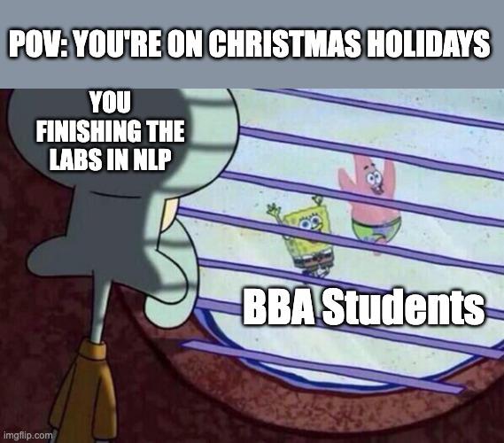

# NLP Labs

Hands-on notebooks for the AIDAMS NLP course by Mr Dallard, grouped by lab delivery. Each lab directory is self-contained so you can focus on a single topic at a time.

  

## Project Structure

- `lab1/` – *NLP Introduction*: baseline preprocessing and classical models (`nlp_introduction.ipynb`).
- `lab2/` – *Optimisation in NLP*: optimisation-focused follow-up notebook (`maths_optimisation.ipynb`).
- `lab3/` – *Transformer Quickstart*: distilled Hugging Face workflow that mirrors the CI-tested notebook (`hello_world_transformers.ipynb`).
- `lab4/` – *Transformer Classification*: production-ready training pipeline and evaluation (`transformer_classification.ipynb`).
- `lab5/` – *Clustering & Topic Modeling*: text clustering using SentenceTransformers, UMAP, HDBSCAN, and BERTopic (`clustering_topic_modeling.ipynb`).
- `lab6/` – *LLM Fine-tuning*: fine-tuning large language models using LoRA and Hugging Face (`llm_finetuning.ipynb`).
- `lab7/` – *Prompting & LangChain*: prompt engineering and building LLM applications with LangChain and Ollama (`prompting_langchain.ipynb`).

## Continuous Integration

Notebook execution is enforced by the **Notebook CI** workflow (`.github/workflows/run-notebooks.yml`). On every push to `main`/`master` and every pull request, GitHub Actions:

1. Checks out the repository and sets up Python 3.10.
2. Installs the shared dependencies defined in `requirements.txt` (which includes the Jupyter tooling required to execute notebooks).
3. Downloads the NLTK tokenizers (`punkt` and `punkt_tab`) so notebooks using `word_tokenize` run without manual setup.
4. Executes every tracked `.ipynb` file from a clean environment, ensuring the labs remain runnable end-to-end.

This guarantees that any change merged into the main branches keeps the teaching material executable for students.
